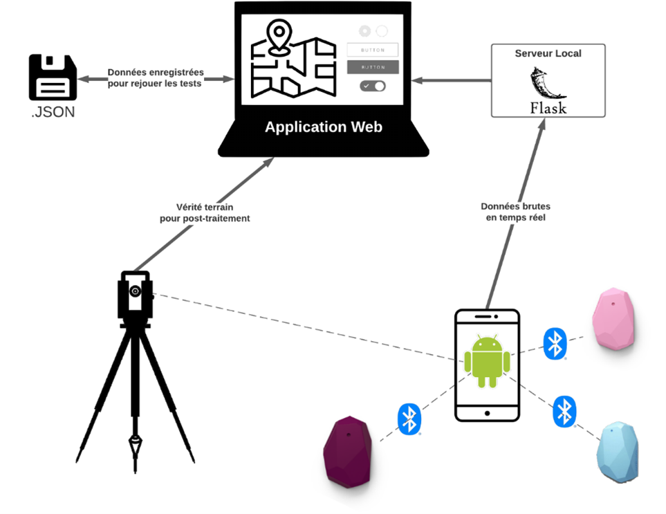

# Projet de positionnement intérieur

## Mise en contexte
Ce répertoire comprend toute l'architecture technologique développée dans le cadre du projet de positionnement intérieur. Les outils développés permettent de :

1. Acquérir des données bluetooth provenant de balises BLE avec un appareil Android (récepteur) à l'aide d'une application native; 
1. Transmettre les données à un serveur local déployé via un ordinateur de contrôle;
1. Traiter les données pour calculer la distance récepteur-balises et la position du récepteur;
1. Afficher en temps-réel les données et résultats dans une interface web;

Voici le schéma de l'architecture développée:


## Utiliser le projet
D'abord, télécharger et installer [VSCode](https://code.visualstudio.com/), [Git](https://git-scm.com/) et [Python](https://www.python.org/) sur son ordinateur pour être en mesure d'effectuer les étapes qui suivent.


1. Cloner le répertoire du projet avec git
```git
git clone https://github.com/GuillaumeLandry/GMT3060-ProjetGenie.git
```

2. Installer la dernière version de l'application Android sur l'appareil qui servira de récepteur (Voir comment installer un ".apk" sur ce [site web](https://www.groovypost.com/howto/install-apk-files-on-android/))
```bash
# Répertoire des fichiers .apk
src/Android/APKs/Release <date-la-plus-récente>/
```

3. Installer les dépendances python nécessaires pour le serveur, les calculs et l'affichage
```bash
pip install -r requirements.txt
```

4. Lancer le serveur de positionnement
```bash
cd src
python server_launcher.py
```

5. Dans l'application Android, aller dans l'onglet "Settings" et modifier l'URL pour celui qui est affiché dans la console lors du démarrage du serveur.

## Pour en apprendre davantage
* [Guide BLE et Android](https://punchthrough.com/android-ble-guide/)
* [Série Youtube BLE](https://www.youtube.com/watch?v=eZGixQzBo7Y)
* [Estimote - Telemetry Packet Description](https://developer.estimote.com/sensors/estimote-telemetry/#estimote-telemetry-packets-description)
* [Android Connectivity Samples](https://github.com/android/connectivity-samples/tree/master)
* [A Practice of BLE RSSI Measurement for Indoor Positioning](https://www.ncbi.nlm.nih.gov/pmc/articles/PMC8347277/)
* [The Challenge of Bluetooth Distance Estimation](http://www.davidgyoungtech.com/2020/05/15/how-far-can-you-go)
* [Micro-Location: BLE and RSSI](https://abaltatech.com/2021/01/microlocation2/)
* [ETH Zurich - Indoor positioning technologies](https://www.research-collection.ethz.ch/bitstream/handle/20.500.11850/54888/eth-5659-01.pdf?sequence=1&isAllowed=y)
* [Marvelmind - Indoor Positionning Technologies Review](https://www.youtube.com/watch?v=zg3oW_U_jdY)
* [Marvelmind - Indoor Navigation & Positionning](https://marvelmind.com/pics/marvelmind_indoor_positioning_technologies_review.pdf)
* [Bluetooth AoA](https://www.blueiot.com/bluetooth-aoa-technology/?utm_source=google-ads&utm_term=bluetooth%20aod&utm_device=c&matchtype=p&utm_location=9000329%7d&creative=610276320621&utm_campaign=17744237731&utm_agid=140302299593&gclid=EAIaIQobChMIyvrEhobK-gIVBfnICh2brAFtEAAYASAAEgJHuvD_BwE)
* [Inpixion - Real-Time Location Systems](https://www.inpixon.com/technology/rtls)
* [Kalman filters explained: Removing noise from RSSI signals](https://www.wouterbulten.nl/posts/kalman-filters-explained-removing-noise-from-rssi-signals/)
* [Simple Android App With Flask Backend](https://www.geeksforgeeks.org/how-to-build-a-simple-android-app-with-flask-backend/)